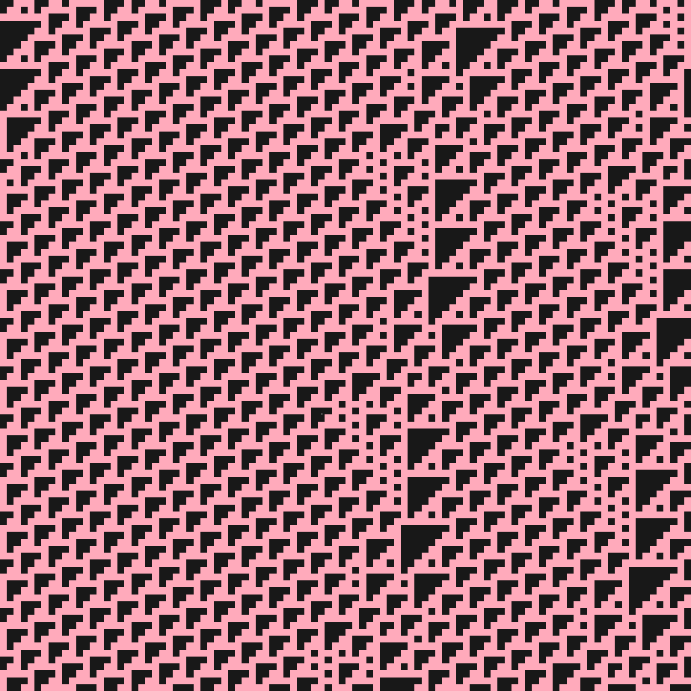
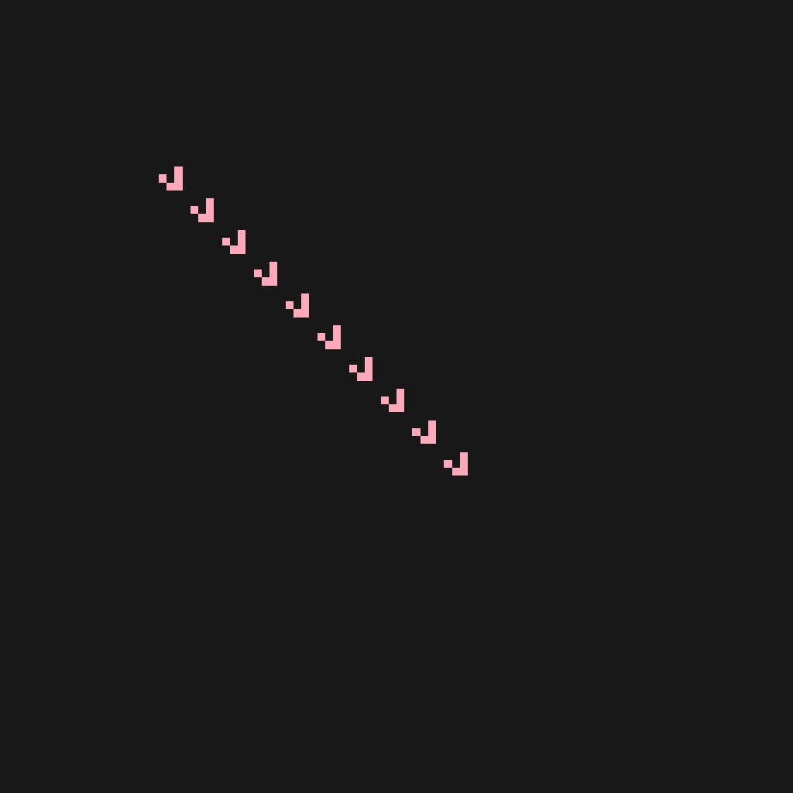
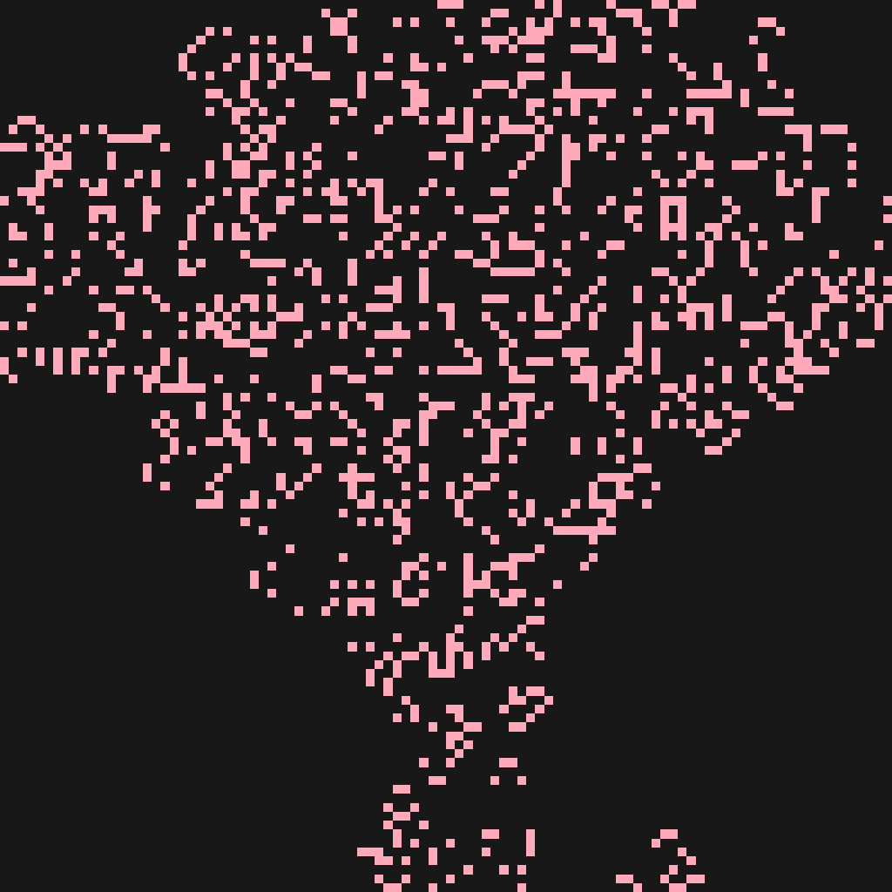

# Celery Tomato

A collection of different [Cellular Automata](https://en.wikipedia.org/wiki/Cellular_automaton) implementations for recreational purposes

## Quick Start

```console
$ make
```
## [Rule 110](https://en.wikipedia.org/wiki/Rule_110)

```console
$ ./rule110
```



## [Conway's Game of Life](https://en.wikipedia.org/wiki/Conway%27s_Game_of_Life)

```console
$ ./gol
```



## [Seeds](https://en.wikipedia.org/wiki/Seeds_(cellular_automaton))

```console
$ ./seeds
```



## [Brian's Brain](https://en.wikipedia.org/wiki/Brian%27s_Brain)

```console
$ ./bb
```


## [Wireworld](https://en.wikipedia.org/wiki/Wireworld)

```console
$ ./wireworld ./images/ww800x600.gif
```


## [Lattice gas automaton](https://en.wikipedia.org/wiki/Lattice_gas_automaton)

TBD

## [Langton's ant](https://en.wikipedia.org/wiki/Langton%27s_ant)

TBD
